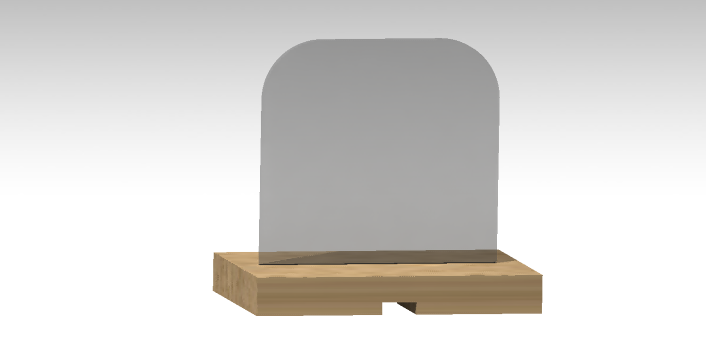
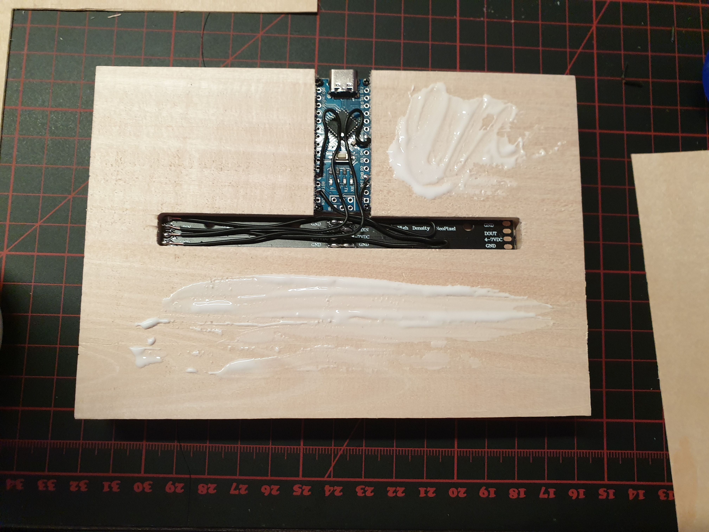
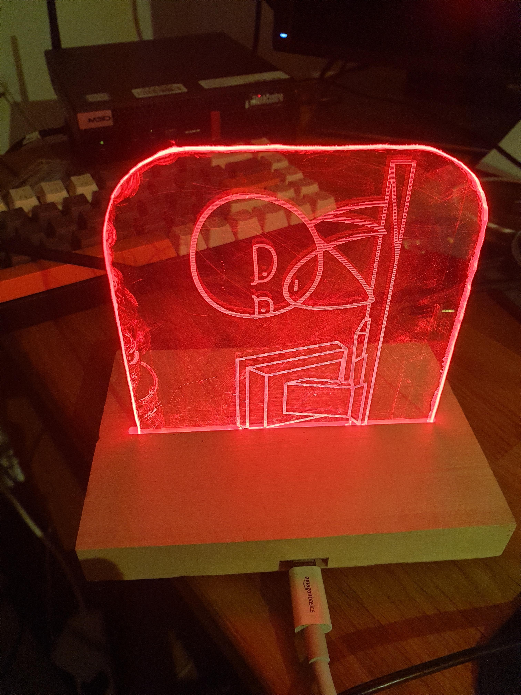
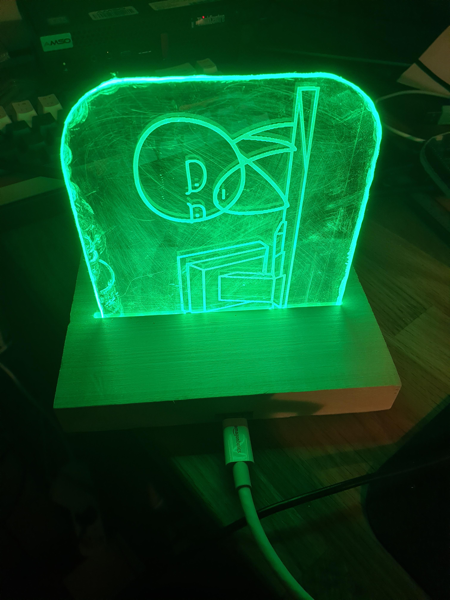

# MS Teams Busy Light

Repository for a DIY Busy light, that should represents the Teams presence status in small box, that will turn a plexiglass 
with indirect LED light into a matching color.

# Hardware

Disclaimer regarding the choice of Hardware: Although there is some hardware that would better fit for the purpose, 
I decided to use the following items, because I had (at least some of them) already in my drawer. 

* plexiglass sheet
* Arduino Nano
* wood 
* WS2812 5050 RGB LEDs (Neopixel)

I created a CAD Modell of it, using Catia. Besides the Part Modell itself, I created the drawing of the plexiglass and 
wooden stand, as well as their PDF exports, so you don't need Catia to open them. Here you can see a first rendering of the model: 

# Software

## Installation

First you need the software to run the Teams presence analyse script. For installing/updating, open a CMD and type:

	winget install -e --id AutoHotkey.AutoHotkey

Download the [Autohotkey Script](Read%20File.ahk) and run it.

## How to get the presence status

There are different ways of fetching the presence status of teams. Microsoft provides the status of your account that 
is used in Teams via the Graph API. This might come in handy for future versions of the busy light: 
instead of just having one Hardware that represents your status in one color, you can split the LED to actually also show 
the status of another colleague. Unfortunately, to access the Graph API, your organization needs to grant consent 
for the organization so everybody can read their Teams status. Since my organization didn't want to grant consent, 
I needed to find a workaround. If you might want to check it on your own hou can find some information on the documentation of
[how to get presence using Graph API][6].
One of them is the monitor the MS Teams log file on the local Harddrive.

The location of this file: 

	C:\Users\%userprofile%\AppData\Roaming\Microsoft\Teams\logs.txt
	
Idea on what/how to read from the log file I got from [this repository][2].
	
### Teams Presence status
Using the Log File, 
this is the List of possible Teams Status that are available:

| StatusName in Teams | StatusName in Log File  |  				Color 					|
|:-------------------:|:-----------------------:|:-------------------------------------:|
|    Available        |        Available        | 	:green_heart: green :green_heart: 	|
|    Busy             |     Busy                | 	 :heart: red :heart:			    |
|    In a meeting     | InAMeeting  			|	 :heart: red :heart:			    |
|    In a call        |     OnThePhone          | 	 :heart: red :heart:			    |
|    Do not disturb   | DoNotDisturb ,Presenting| 	 :heart: red :heart:			    |
|    Be right back    |     BeRightBack         | :yellow_heart: yellow :yellow_heart:	|
| 	 Away             |		Away				| :yellow_heart: yellow :yellow_heart:	|
|	 Offline          |		Offline				| :yellow_heart: yellow :yellow_heart:	|
| 		N/A			  | Unknown,NewActivity,ConnectionError,NoNetwork		| ?		 	|

# Results and Assembly

## Assembly 
After creating the wooden stand, plexiglas and soldering of the electronics, you need to put everything together. should be selfexplaining, but here have a look of my assembly:

You can see here, that I prepared to glue a thin layer of vaneer wood to the  backside, too cover the electronics. 

## Results
Here you can find some pictures of the current state / final version of the busy light:

# Reference / Link Collection

I gathered the above information from various sources. Here to find the link collection, everything not directly linked above
was just added to this file for the complete Link list, I used for inspiration, even if it was not used at the end. 

[1]: <https://www.reddit.com/r/MicrosoftTeams/comments/iuxcac/diy_busylight/?rdt=45645> "Reddit Discussion"
[2]: <https://github.com/ajobbins/AHK-Teams-Presence> "AutoHotKey Log"
[3]: <https://github.com/JnyJny/busylight> 
[4]: <https://github.com/toblum/ESPTeamsPresence>
[5]: <https://www.eliostruyf.com/diy-building-busy-light-show-microsoft-teams-presence/>
[6]: <https://learn.microsoft.com/en-us/graph/api/presence-get?view=graph-rest-beta&tabs=http#code-try-1>
[7]: <https://www.hackster.io/benedikt-hubschen/office-busylight-1a8e30>
[8]: <https://teamsqueen.com/2021/08/19/a-busylight-with-microsoft-teams/>

